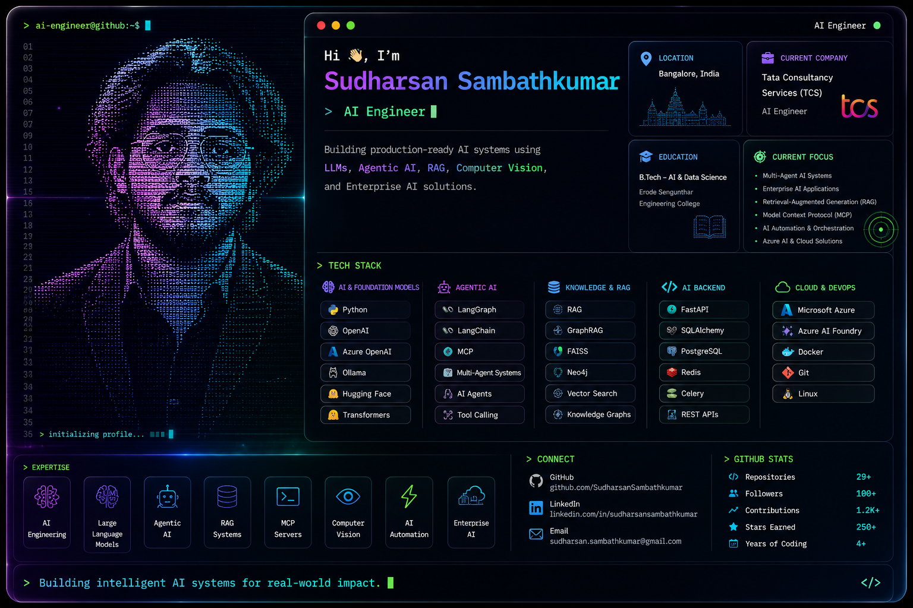

<div align="center">



<br><br>

# 👋 Hi, I'm Sudharsan Sambathkumar


<br>

<a href="https://github.com/SudharsanSambathkumar">

</a>


</div>

---

# 🚀 About Me

```yaml
Name: Sudharsan Sambathkumar

Role: AI Engineer

Company: Tata Consultancy Services (TCS)

Location: Bangalore, India

Education:
  B.Tech - Artificial Intelligence & Data Science

Specialization:
  - Agentic AI
  - Enterprise AI
  - Large Language Models
  - Multi-Agent Systems
  - Retrieval-Augmented Generation
  - Model Context Protocol (MCP)
```

---

# ⚡ Current Focus

- 🤖 Enterprise AI
- 🧠 AI Agents
- 🔄 Multi-Agent Systems
- 📚 Retrieval-Augmented Generation (RAG)
- 🕸️ GraphRAG
- 🧩 Model Context Protocol (MCP)
- ⚙️ AI Automation
- ☁️ Azure AI

---

# 🧠 AI Tech Stack

## Foundation Models


---

## Agentic AI


---

## Knowledge Systems


---

## Backend


---

## Cloud & DevOps


---

---

# 🌐 Connect With Me

<p align="center">

<a href="https://github.com/SudharsanSambathkumar">

</a>

<a href="https://www.linkedin.com/in/YOUR_LINKEDIN">

</a>

<a href="mailto:YOUR_EMAIL">

</a>

</p>

---

<div align="center">

## 💭 Quote

*"Building intelligent AI systems for real-world impact."*

</div>

---


